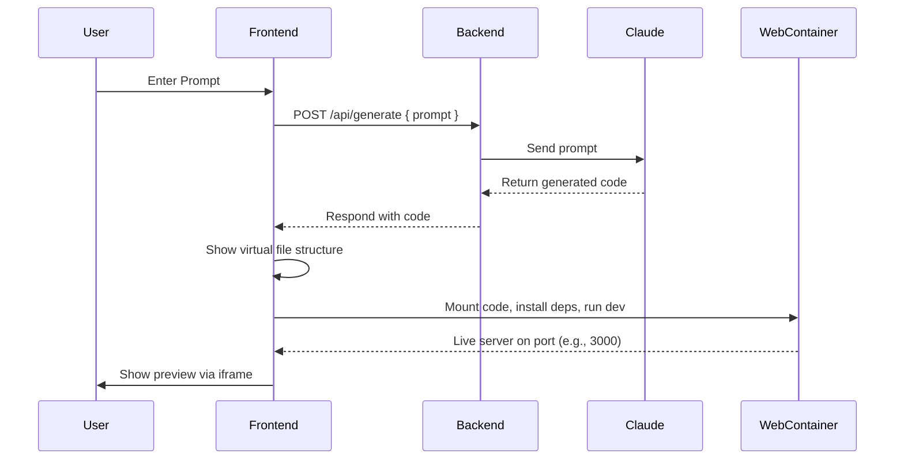

# 🛠️ Website Builder (AI-Powered)

Welcome to the **Website Builder**, an AI-powered application that generates fully responsive and customizable websites from natural language prompts. It uses Claude AI to convert prompts into complete website code, providing a seamless user experience for anyone looking to generate web templates without writing code. The generated code is visualized like a file system, run directly in the browser using WebContainers, and previewed live — without any server deployment.

---

## 🌐 Live Demo

🚀 [Try the Live App](https://eloquent-salamander-3fd84a.netlify.app/)  
🧠 Powered by Claude AI + React + Tailwind CSS

---

## ✨ Features

- 🧠 **AI-Based Code Generation** – Converts user prompts into HTML/CSS using Claude AI.
- 🖥️ **Live Preview** – Instantly see the generated website in a preview pane.
- ⬇️ **Download Code** – Easily download the full HTML/CSS code.
- 🎨 **Styled with Tailwind CSS** – Ensures modern, responsive design.
- 🔧 **Full Stack** – Frontend (React) + Backend (Node.js/Express)

---

## 🧠 How It Works

### 1. User Enters a Prompt
The user types something like:

> "Create a portfolio website with a dark theme and responsive layout"

### 2. Prompt Sent to Claude AI
The backend sends this prompt to Claude AI which returns:
- HTML (e.g., `index.html`)
- CSS (e.g., `style.css`)
- Optional JavaScript (e.g., `script.js`)

### 3. Code Displayed Like a Repository
The generated files are rendered in a code viewer:
- File tree view
- Monaco editor or Ace editor for syntax highlighting

### 4. Code Runs in the Browser with WebContainers
Using [StackBlitz WebContainers](https://webcontainers.io/):
- Mount the code files
- Run `npm install` (if needed)
- Start a local dev server (`npm run dev`)

### 5. Live Preview
A live preview of the website is embedded in an `<iframe>` from the in-browser dev server.

---

## 🧰 Tech Stack

| Component   | Technology            |
|------------|------------------------|
| Frontend   | React, Tailwind CSS    |
| Backend    | Node.js, Express       |
| AI Model   | Claude API (Anthropic) |
| Code Runner| StackBlitz WebContainers |
| Code Viewer| Monaco Editor / Ace    |
| Deployment | Vercel (frontend), Render (backend) |

---

---

## 🧪 Example Flow (Diagram)



## 📁 Project Structure

```
Website-Builder/
├── client/         # React frontend
│   ├── public/
│   ├── src/
│   │   ├── components/
│   │   ├── pages/
│   │   └── App.jsx
├── server/         # Express backend
│   ├── routes/
│   ├── controllers/
│   └── index.js
└── README.md
```

---

## 🚀 Getting Started

### 1. Clone the Repository

```bash
git clone https://github.com/nandhan7/Website-Builder.git
cd Website-Builder
```

### 2. Install Dependencies

```bash
# Frontend
cd client
npm install

# Backend
cd ../server
npm install
```

### 3. Set Up Environment Variables

Create a `.env` file in the `server/` directory:

```env
PORT=5000
CLAUDE_API_KEY=your_claude_api_key_here
```

Replace `your_claude_api_key_here` with your actual Claude API key.

### 4. Run the Project Locally

```bash
# Start backend
cd server
npm start

# Start frontend in a new terminal
cd ../client
npm run dev
```

Open `http://localhost:5173` in your browser to use the app.

---

## 💡 Prompt Examples

You can try prompts like:

- "Create a personal portfolio website"
- "Design a product landing page for a SaaS app"
- "Generate a responsive login/signup page"

---

## 📦 Deployment

- **Frontend** deployed on [Netlify](https://netlify.com)
- **Backend** deployed on [Render](https://render.com)

---

## 🧑‍💻 Author

Made with ❤️ by [B V Nandhan](https://github.com/nandhan7)

---

## 🪪 License

This project is licensed under the [MIT License](LICENSE)

---

## 🙌 Contributions

Contributions, issues, and feature requests are welcome.  
Feel free to open an issue or submit a pull request!
